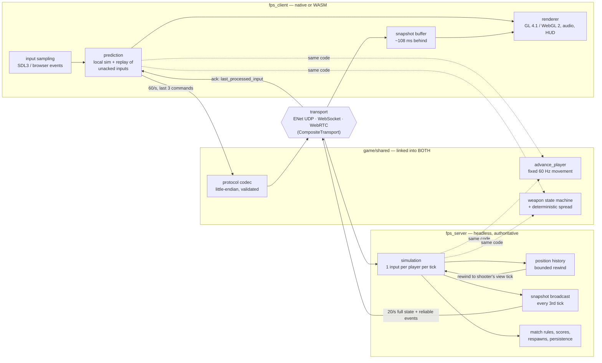

# FPS

An online multiplayer first-person shooter and the C++23 engine underneath it:
an authoritative dedicated server on a fixed 60 Hz tick, client-side
prediction with server reconciliation, snapshot interpolation, and server-side
lag compensation — playable as a native binary or in a browser over
WebAssembly.

[](https://github.com/YheChen/FPS/actions/workflows/ci.yml)

Everything below is implemented in this repository. Third-party code is
limited to libraries (SDL3, Jolt, ENet, GLM, cgltf, stb, miniaudio, ImGui,
libdatachannel); the engine, the netcode, the wire protocol, the WebSocket
server, the build and the deployment pipeline are the project.

**What is here**

- **Custom C++23 engine** — [`engine/`](engine): Jolt-backed physics and a
  kinematic FPS character controller, an OpenGL 4.1 core / WebGL 2 renderer
  (directional shadow map, HDR bloom + tonemap + FXAA chain, GPU skinning,
  particles, normal mapping, procedural sky), glTF asset loading, miniaudio
  spatial audio, SDL3 platform layer, and the networking stack. Split into a
  headless-safe `engine` target and a client-only `engine_platform` target, so
  the dedicated server never links SDL, GL, or audio.
- **Authoritative dedicated server** — [`game/server/`](game/server): owns all
  state (positions, health, weapons, hits, deaths, scores, team assignment,
  match timer), consumes one validated input per player per tick, broadcasts
  20 Hz snapshots. Clients never send positions or hit claims.
- **Client-side prediction and reconciliation** —
  [`game/shared/prediction.cpp`](game/shared/prediction.cpp): the client
  simulates locally with the *same* `advance_player` the server runs, then
  rewinds to each authoritative state and replays every unacknowledged input.
- **Snapshot interpolation** —
  [`game/shared/interpolation.cpp`](game/shared/interpolation.cpp): remote
  players are rendered ~108 ms in the past from a bracketed sample pair, with
  wrap-aware angle interpolation.
- **Server-side lag compensation** —
  [`game/shared/lag_comp.h`](game/shared/lag_comp.h): per-player position
  history, hitscan resolved against victims where the *shooter* saw them, with
  the client-declared view tick clamped to a 15-tick (~250 ms) rewind window.
- **Custom binary protocol** —
  [`game/shared/protocol.cpp`](game/shared/protocol.cpp): 22 message types,
  explicit little-endian encoding, no struct memcpy, validation on every read
  (bounds, enum ranges, string caps, NaN/Inf rejection), versioned handshake.
  Currently protocol 11.
- **Three interchangeable transports** — ENet/UDP for native clients, a
  hand-written RFC 6455 WebSocket server for browsers
  ([`engine/net/websocket_host.cpp`](engine/net/websocket_host.cpp)), and
  WebRTC DataChannels configured unordered with no retransmits
  ([`engine/net/webrtc_host.cpp`](engine/net/webrtc_host.cpp), with a
  hand-written browser half behind a C boundary), multiplexed by a
  `CompositeTransport` the game logic cannot tell apart. WebRTC is a build-time
  opt-in (`FPS_ENABLE_WEBRTC`) because libdatachannel needs a TLS backend, so
  the live deployment currently serves browsers over `wss://`.
- **Latency, jitter and packet-loss simulation** — built into the transport
  layer, driven either by CLI flags or by live ImGui sliders, alongside a
  prediction-error plot.
- **Deterministic replays** — [`game/shared/replay.cpp`](game/shared/replay.cpp):
  matches record *inputs only* and are re-simulated through the same movement
  code, so a divergent replay is a determinism bug. There is a viewer with
  scrubbing, speed control and per-player cameras.
- **Bots** — [`game/shared/bot.cpp`](game/shared/bot.cpp): a pure
  `decide(state, senses, config, seed)` function producing ordinary
  `InputCommand`s, so bots exercise the real movement, hit detection, scoring
  and replay paths. Four difficulty levels.
- **WebAssembly client + deployment pipeline** — Emscripten/WebGL 2 build,
  published to a CDN by CI only after a headless-Chrome smoke test loads it;
  the server ships as a Docker image behind a TLS reverse proxy and redeploys
  itself, with protocol-version guards in both directions.

Not implemented, and deliberately: snapshot delta compression and
quantization (measured bandwidth does not justify them), and anti-cheat beyond
server authority — clients receive full state, so this stops packet forgery and
impossible actions, not aimbots or wallhacks.

## Demo

A live build is deployed: **[fps.yanzhenchen.ca](https://fps.yanzhenchen.ca)**.
The client is a static WebAssembly bundle on Vercel; the dedicated server is
self-hosted on a home machine, so it can be offline. The page loads either way
and reports the connection state.

<!--
No gameplay media is committed yet. The clips worth capturing, in order of how
much they explain:

1. A 10-15 s GIF of a normal firefight (two clients, one machine) for the top
   of this README.
2. Prediction under load: one client running with
   `--fake-latency 150 --fake-jitter 40 --fake-loss 5`, with the ImGui debug
   panel open so the prediction-error plot and RTT are visible. This is the
   single most convincing clip in the project — local movement stays crisp
   while the error graph shows corrections being absorbed.
3. Lag compensation: shooter at high simulated latency landing hits on a
   moving target, with the server's `lag comp: shot resolved N ticks in the
   past` debug line in frame.
4. The replay viewer scrubbing a recorded match with the camera following a
   player.
5. The browser client at fps.yanzhenchen.ca, to show the same code running
   over WebSockets in a tab.

Screenshots are already possible headlessly:
`fps_client --screenshot out.png --run-seconds 5 --fixed-yaw 0 --auto-walk`.
-->

## Architecture

Three layers with a strict dependency direction — `game` → `engine` → third
party — and one rule that shapes everything else: the simulation code the
client predicts with and the code the server rules with are the same
translation units, compiled into both binaries.



One tick of the loop, from the client's point of view:

```
client tick N
  sample input ──▶ InputCommand{seq=N, yaw, pitch, buttons, weapon, view_tick}
       │
       ├─▶ advance_player(local state)          # prediction: no waiting
       ├─▶ push to pending ring buffer
       └─▶ send (with commands N-1, N-2 for loss redundancy)

server tick M
  consume exactly one queued command per player (reuse last if starved)
  advance_player(authoritative state) ──▶ position history[M]
  resolve fire against victims rewound to clamp(view_tick, M-15, M)
  every 3rd tick: broadcast Snapshot{tick=M, last_processed_input, players[]}

client, on snapshot
  remote players ──▶ SnapshotBuffer, rendered at (newest_tick - 6.5)
  local player   ──▶ drop acked inputs, restore server state,
                     replay the rest through advance_player,
                     carry the visual delta as a decaying offset
```

The engine module graph (and its dependency rules) is in
[docs/architecture.md](docs/architecture.md).

## Networking model

Authoritative client-server. Detail and rationale live in
[docs/networking.md](docs/networking.md) and
[docs/packet-format.md](docs/packet-format.md); the summary:

| | |
|---|---|
| Server simulation | 60 Hz fixed timestep, decoupled from render rate |
| Client simulation | 60 Hz fixed timestep, same tick length and same code |
| Input rate | 60 packets/s, each carrying the newest command plus the previous 2 |
| Snapshot rate | 20 Hz (every 3rd tick), full state, `10 + 34·players` bytes on the wire |
| Interpolation delay | 6.5 ticks (~108 ms): 2 snapshot intervals plus jitter margin |
| Rewind window | 15 ticks (~250 ms), hard-clamped server-side |
| Max players | 8 |

**Server authority.** A client sends buttons and view angles. Movement is
simulated from those inputs server-side, so speed and teleport cheats are
structurally impossible rather than heuristically detected. Firing is a button
bit: rate of fire, ammo, reload timing, range, spread cone and hit resolution
are all decided by the server, which runs the same weapon state machine the
client uses for its own prediction and offline play.

**Channels.** Two, mirrored across every transport: reliable-ordered for the
handshake and game events (joins, damage, deaths, scores, chat, map changes),
unreliable-sequenced for inputs and snapshots. On WebRTC that split is
`reliable` and an unordered `maxRetransmits: 0` DataChannel; on WebSockets TCP
makes everything reliable-ordered, which is exactly why the WebRTC transport
exists.

**Prediction and reconciliation.** Each `InputCommand` carries a sequence
number; every snapshot carries `last_processed_input` for its recipient. The
client discards acknowledged commands, resets to the authoritative
position/velocity/ground state, replays what is left, and compares. A residual
error is added to a smoothing offset that decays exponentially
(`exp(-15·dt)`, so ~100 ms) instead of snapping the camera; anything over 2 m
is treated as a teleport and snapped outright.

**Interpolation.** Remote players are never predicted. Samples land in a
per-player ring buffer keyed by server tick, and the client renders them at a
fractional tick that trails the newest snapshot, advanced at tick rate and
slewed toward the target so jitter does not cause visible time warps.

**Lag compensation.** Every input packet carries the tick the client was
*rendering* remote players at. The server keeps 32 ticks of per-player
positions, clamps that claimed tick into `[now - 15, now]`, and tests hitscan
rays against capsules at those historical positions — crouch height included.
Damage is then per-pellet distance falloff times a per-weapon hit-zone
multiplier, accumulated per victim so a shotgun blast is one damage event.

**Loss, dup and reordering.** Inputs are sent redundantly, so a single lost
packet costs nothing. Snapshots are full-state: a lost one only widens
interpolation. Stale snapshots are dropped by tick number, duplicate and
out-of-order inputs by sequence number. When a player's queue starves, the
server reuses their last command for a few ticks and then fast-forwards, rather
than freezing them.

**Hostile input.** Every deserializer returns `nullopt` rather than a partial
message; one bad read poisons the reader. Per-connection limits cover input
packet rate (200/s), malformed message count, chat rate, and — on the
internet-facing WebSocket path — frame size (64 KiB), reassembled message size
(256 KiB), pre-upgrade buffer (16 KiB) and time-to-upgrade (10 s). That last
one exists because `max_peers` sockets that send *nothing* is the cheapest way
to deny every real player a slot.

**Testing hooks.** `--fake-latency`, `--fake-jitter` and `--fake-loss` apply
one-way delay and drop packets inside the transport (loss only on the
unreliable channel, since ENet would retransmit anyway), and the same knobs are
live sliders in the debug overlay next to a prediction-error plot.

## Interesting engineering problems

**1. Making prediction and authority agree.** Prediction is only cheap if
replaying an input on the client produces the same result as the server got.
That forced `advance_player` to be a pure function of `(state, command, dt)`
plus collision queries: the character controller is used as scratch state, with
position and velocity written *into* it before each step, so any historical
state can be re-simulated. The same requirement rules out convenient
non-determinism everywhere else — weapon spread is a hash of
`(tick, shooter, pellet)` rather than a PRNG with state
([`rng.h`](game/shared/rng.h)), and bot decisions are a pure function of
senses plus a seed. The payoff is a replay format that stores no positions at
all: a replay that lands somewhere different *is* a determinism regression, and
the test suite uses one that way.

**2. Rewinding time without trusting the client.** Lag compensation means
letting the shooter's stale view of the world decide who got hit, which is a
client-supplied number driving server-side damage. The design keeps that
bounded: the view tick is range-checked at deserialization, forced monotonic
per player, and clamped into a 15-tick window at fire time, and the history
buffer is only 32 ticks deep so there is nothing older to reach. The rewound
capsule is captured at the moment the ray wins, not recomputed afterwards —
otherwise the hit zone gets classified against the player's *current* position
while the ray was tested against their old one.

**3. Giving a browser UDP semantics.** Browsers cannot open UDP sockets, so
the web client first spoke WebSockets — TCP, therefore head-of-line blocking,
so one lost packet stalls every snapshot queued behind it. The fix was a
WebRTC DataChannel configured unordered with `maxRetransmits: 0`. Getting
there took a hand-written RFC 6455 server (SHA-1 + base64 handshake, masking,
fragment reassembly, non-blocking sockets on both Winsock and POSIX) because a
dependency for one upgrade handshake was not worth it, an `IServerTransport`
seam so `ServerGame` cannot tell an ENet peer from a DataChannel peer, and a
signalling router in front of the game: SDP and ICE ride the existing
WebSocket connection as ordinary protocol messages, so no second listening
port exists and the negotiation is testable in-process. A signalling socket is
deliberately *not* a game session — the browser sends its `ClientHello` over
the DataChannel once it opens, so the two peer spaces have to be mapped in
both directions.

**4. Third-party callback threads in a single-threaded engine.** libdatachannel
fires callbacks on its own threads. Everything they touch sits behind one mutex
and is drained on the main thread in `poll()`, so no other engine code ever
sees a second thread. The trap: destroying an `rtc::PeerConnection` joins its
callback threads, and those callbacks take that same mutex — reaping a closed
peer while holding the lock deadlocks. Doomed peers are moved out under the
lock and destroyed after releasing it. The failure was rare per run, so CI
builds the WebRTC path under ASan/UBSan and repeats the live loopback test
`--repeat until-fail:20`; "it passed once" is not evidence for a shutdown race.

**5. A deploy pipeline that can refuse itself.** Client and server ship
together with no in-protocol compatibility, and they deploy by different
mechanisms — a static bundle on a CDN, a container on a machine at home — so
nothing enforces ordering. A protocol bump reaching one side turns every
connection into `ServerReject(VersionMismatch)`: the game goes down from a
green build. So both halves fail closed. CI will not publish a client whose
protocol has moved unless the live server answers a real WebSocket handshake at
that version, and the host's self-deploy script refuses to ship a server whose
protocol has moved past the published client, which it reads from a git tag CI
moves only after verifying the deployed bytes. The script's decision table has
its own test suite (`docker` stubbed, "GitHub" a temp bare repo) because it is
the one component in the project that has taken the live game down — twice, both
times by inferring what was deployed instead of recording it.

## Project structure

```
engine/           Reusable engine library (~8.3k lines). No game concepts.
  core/           Logging, fixed timestep, clock, assertions
  platform/       SDL3 window + GL context, platform-free input state
  rendering/      Shaders, meshes, camera, shadow map, post FX, particles,
                  GPU skinning (joint texture), procedural sky, screenshots
  physics/        Jolt wrapper (pimpl) + kinematic character controller
  assets/         glTF (cgltf) loading, texture decode, asset cache, paths
  animation/      Skeleton sampling and pose evaluation
  audio/          miniaudio playback + spatial listener
  net/            ENet wrapper, RFC 6455 WebSocket server, WebRTC host and
                  browser client, transport composition, byte serialization
  debug/          ImGui overlay layer

game/             The FPS itself (~10.5k lines)
  shared/         Compiled into BOTH client and server: movement, weapons,
                  hitscan, prediction, interpolation, lag compensation,
                  protocol, replay, bots, footsteps, deterministic RNG
  client/         Render loop, HUD, menu, killcam, chat, replay viewer,
                  connection state machine, browser WebRTC glue
  server/         Authoritative ServerGame (a library, so it is testable),
                  signalling router, persistent stats store, main loop

tests/            299 Catch2 test cases (~8.7k lines) + a shell test suite
                  for the deploy script's decision table
tools/            Asset generators (maps, character, weapons, textures,
                  sounds, icon), browser smoke test, protocol probe,
                  self-deploy script, GCC/include lint helpers
deploy/           Dockerfile, compose stack, Caddyfile, systemd units
web/              Emscripten shell page, favicon, CDN config
docs/             Architecture, networking, packet format, build, deploy,
                  rendering, physics, milestones, decision records
```

Assets are generated, not committed as opaque blobs:
[`tools/gen_arena.py`](tools/gen_arena.py) is a dependency-free GLB writer, so
a new map is a list of boxes and spawn points; textures, sounds, the character
rig and the weapon models have equivalent generators.

## Building and running

Requires CMake ≥ 3.25 and a C++23 compiler (AppleClang 15+, Clang 17+,
GCC 13+, MSVC 2022 17.8+). Dependencies are fetched at configure time by
`FetchContent` at pinned tags, so the first configure needs network access.

```sh
cmake --preset debug
cmake --build --preset debug --parallel
ctest --preset debug
```

Binaries land in `build/debug/game/`. Presets: `debug`, `release`, `asan`
(ASan + UBSan), `web` (Emscripten).

```sh
./build/debug/game/fps_server --port 7777 --ws-port 7778 --bots 3
./build/debug/game/fps_client                    # menu: Connect / Practice offline
./build/debug/game/fps_client --connect 127.0.0.1
```

Useful server flags: `--map`/`--maps a.glb,b.glb` (rotation), `--bots N`,
`--bot-skill easy|normal|hard|deadly`, `--stats PATH` (career records),
`--record PATH` / `--replay PATH`, `--no-enet` (WebSocket only), `--webrtc`,
`--run-seconds N`, `--verbose`.

Useful client flags: `--connect HOST --port N --name X`, `--map`,
`--fake-latency MS --fake-jitter MS --fake-loss PCT`, `--no-vsync`,
`--replay PATH`, plus headless verification hooks `--screenshot PATH`,
`--run-seconds N`, `--fixed-yaw R`, `--fixed-pitch R`, `--auto-fire`,
`--auto-walk`, `--aim`, `--weapon N`.

In game: `WASD` + mouse, space to jump, shift to sprint, ctrl to crouch,
right mouse to aim, `1`-`5` for weapons, `R` to reload, `Tab` for the
scoreboard, `T` or `Enter` for chat, `Escape` to release the mouse, `F1` fly
camera, `F3` physics debug draw.

**Browser client** (Emscripten + WebGL 2):

```sh
source ~/emsdk/emsdk_env.sh
emcmake cmake --preset web
cmake --build --preset web --parallel
python3 -m http.server -d build/web/game 8099   # open /fps_client.html
```

**Dedicated server on a headless host** — skips SDL3, ImGui, glad and
miniaudio entirely (SDL3's CMake hard-errors when no X11/Wayland development
libraries are present, whether or not the target is built):

```sh
cmake --preset release -DFPS_BUILD_CLIENT=OFF -DFPS_BUILD_TESTS=OFF
cmake --build --preset release --target fps_server --parallel
```

CMake options: `FPS_BUILD_TESTS` (ON), `FPS_BUILD_CLIENT` (ON),
`FPS_ENABLE_SANITIZERS` (OFF), `FPS_WARNINGS_AS_ERRORS` (OFF locally, always
ON in CI), `FPS_ENABLE_WEBRTC` (OFF; needs a TLS backend).

More detail, including the pre-PR GCC/header checks and the browser smoke
test, is in [docs/build.md](docs/build.md); deployment is
[docs/deploy.md](docs/deploy.md).

## Testing

**299 Catch2 test cases** in [`tests/`](tests), run by `ctest` on every push
and pull request. They cover the parts where a bug is invisible until someone
plays: protocol round-trips and malformed-packet handling, the `ByteReader`
poisoning discipline, prediction and reconciliation, the interpolation buffer,
rewind clamping, hitscan intersection math and hit zones, the weapon state
machine, `ServerGame` combat/scoring/match rules, the WebSocket framing and
DoS limits, the signalling router, replay encode/decode plus a determinism
regression, bot decisions, and the persistence store.

Beyond unit tests, [CI](.github/workflows/ci.yml) runs:

- Debug build + tests on Ubuntu, macOS and Windows, warnings as errors.
- The same under ASan + UBSan with WebRTC enabled, plus the DataChannel
  loopback test repeated 20× to catch the shutdown race.
- The Emscripten build, loaded in headless Chrome by
  [`tools/web_smoke.mjs`](tools/web_smoke.mjs), which checks the artifact is
  real wasm, that the client reaches its frame loop, that the framebuffer
  contains more than one colour, and that the frame rate is not pathological —
  once normally and once against a 0-height canvas, to reproduce a startup race
  that shipped before.
- A server-only build inside bare Fedora and Ubuntu containers, asserting no
  client dependency was even fetched, then starting the server with bots to
  prove it loads assets and serves. This exists because the documented deploy
  build could not work; the job is what keeps the instructions honest.
- The container image built and *run* until its healthcheck — which speaks the
  real WebSocket upgrade and `ClientHello`/`ServerWelcome` — reports healthy,
  plus `shellcheck` and the autodeploy decision-table tests.
- clang-format and a standard-header check (libc++ pulls in `<algorithm>`
  transitively, so a missing include builds on macOS and fails on MSVC).

Measured numbers that exist today, all reproducible from the repo:

- Snapshot size is `10 + 34·players` bytes from the encoder — ~282 B at 8
  players, 20/s, ≈ 5.6 kB/s per client before framing;
  [docs/deploy.md](docs/deploy.md) works that out to ~0.45 Mbit/s upstream for
  a full server with WebSocket + TLS + TCP overhead.
- Bot lethality per difficulty over a deterministic 60 s four-bot match
  (kills and average life per skill level) is tabulated in
  [docs/build.md](docs/build.md#bot-difficulty).
- Browser smoke-test baselines on SwiftShader: ~40 fps locally versus 5.5–7 fps
  on a GitHub runner, which is why its floors are set at 1 fps and 32 distinct
  colours rather than at local numbers.
- The client's debug overlay reports live RTT, acked input sequence, pending
  prediction depth, per-connection byte counters and reconciliation error in
  metres, with a rolling plot of the last few hundred corrections.

**Potential measurements** — worth producing, not currently claimed anywhere:
mean and p99 prediction error at 0/50/150/300 ms simulated latency; server
tick-time distribution at 8 players versus 8 bots; time-to-hit-registration
with and without lag compensation; and a wasm bundle size / cold-load time
figure for the browser client.

## Technical decisions

Recorded as ADRs in [docs/decisions/](docs/decisions); the ones that shaped
the code most:

- **Authoritative server over peer-to-peer or lockstep.** A shooter needs
  someone to arbitrate hits, and lockstep would put every player's input
  latency on everyone's screen. The cost is that the server is a single point
  of failure and clients must be corrected constantly, which is what
  prediction and reconciliation are for.
- **Fixed 60 Hz simulation on both sides, rendering decoupled.** Matching tick
  lengths make reconciliation a 1:1 replay rather than a resampling problem.
  60 Hz because hitscan combat feels wrong below it and 8 players on a small
  map is cheap to simulate.
- **Full snapshots, no delta compression or quantization.** ~5.6 kB/s per
  client at 8 players does not justify the complexity, and full snapshots mean
  a lost packet costs nothing but a slightly wider interpolation window. The
  arithmetic is written down so the decision can be revisited when the numbers
  change.
- **Interpolate remote players, predict only yourself.** Predicting other
  players means guessing their inputs; interpolating them means rendering them
  slightly late. Lag compensation is what pays that ~108 ms back at the moment
  it matters, which is the shot.
- **Replays store inputs, not positions.** Smaller, and it turns the replay
  system into a determinism check instead of a parallel truth that can drift
  away from the code that produced it.
- **`ServerGame` as a library, not just an executable.** Combat, scoring and
  match rules were the least-tested code in the project while they lived in
  `main.cpp` — nothing in `tests/` could construct one. The executable now
  holds only argument parsing, asset loading and the run loop.
- **A transport interface instead of a transport.** ENet, WebSocket and
  WebRTC differ enough to matter (UDP vs TCP vs SCTP, and who can even open
  them), and the game layer knows about none of them.
- **Generated assets over committed binaries.** Every map, texture, sound and
  model has a script that produces it, so an asset change is a reviewable diff
  rather than an opaque blob.

## Scope

A personal project, and sized like one: 8 players, one match mode (two-team
deathmatch, sides auto-balanced on join), two arenas, no accounts, no
matchmaking, no production anti-cheat. It is not an attempt at a general-purpose engine — every system in
`engine/` exists because this game needed it. The milestone-by-milestone
roadmap, including what each one actually delivered and what it broke on the
way, is in [docs/milestones.md](docs/milestones.md).
