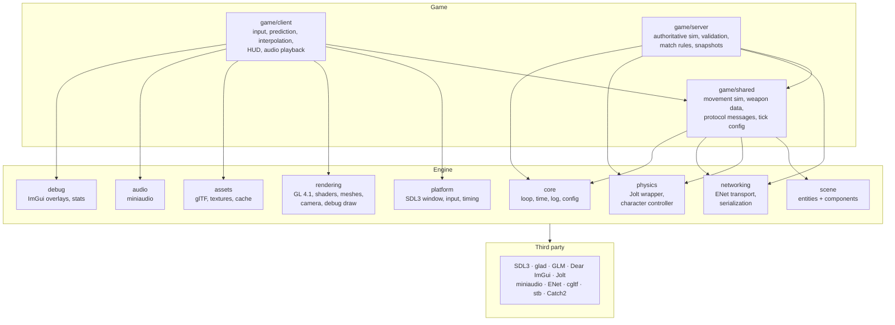

# Architecture

## Overview

Three layers, strict dependency direction (game → engine → third party):

- **`engine/`** — reusable library. Knows nothing about weapons, health, or
  matches. Provides platform, rendering, assets, physics wrapper, audio,
  networking transport + serialization, and debug tooling.
- **`game/shared/`** — the simulation both sides must agree on: player
  movement code, weapon definitions, protocol messages, tick constants.
  Compiled into both client and server. **This is the keystone of
  client-side prediction**: the client predicts with byte-for-byte the same
  movement code the server runs.
- **`game/client/`** — rendering, input collection, prediction,
  interpolation, HUD, audio playback. Trusts nothing it computes; the server
  can always overrule it.
- **`game/server/`** — authoritative simulation, input validation, match
  rules, snapshot broadcasting. Headless; never links renderer/audio/window
  code.



## Key rules

1. **Server is authoritative.** Clients send *inputs*, never positions or
   hit claims. The server simulates and broadcasts results.
2. **Fixed-timestep simulation** (60 Hz), decoupled from render frame rate.
   Rendering interpolates.
3. **Shared simulation code** lives in `game/shared/` and must stay
   deterministic enough for prediction (same code, same inputs → same result
   on one machine; small cross-machine float drift is absorbed by
   reconciliation).
4. **No raw structs on the wire.** All messages go through explicit
   little-endian serialization with validation on read
   (see [packet-format.md](packet-format.md)).
5. **Engine never includes game headers.** If engine code wants a game
   concept, the design is wrong.
6. Entities are IDs; components are data; systems are functions. No deep
   inheritance hierarchies.

## Main loop shape (from Milestone 1 on)

```
while (running):
    poll platform events
    poll network
    accumulator += frame_dt
    while accumulator >= tick_dt:        # fixed 60 Hz simulation
        sample input -> InputCommand
        simulate one tick (shared code)
        accumulator -= tick_dt
    alpha = accumulator / tick_dt
    render(interpolate(prev_state, curr_state, alpha))
    draw debug UI
```

The dedicated server runs the same fixed-tick loop without the render steps,
sleeping until the next tick.

## Documents

- [networking.md](networking.md) — client/server model, tick and snapshot rates
- [packet-format.md](packet-format.md) — wire format, message catalog
- [coding-standards.md](coding-standards.md) — style, ownership, threading
- [milestones.md](milestones.md) — roadmap
- [decisions/](decisions/) — architecture decision records
